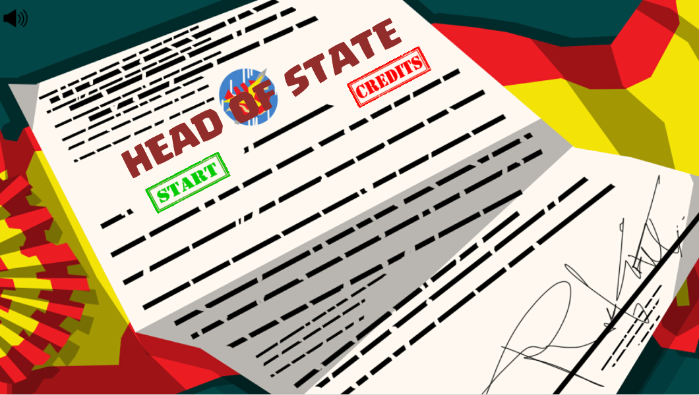
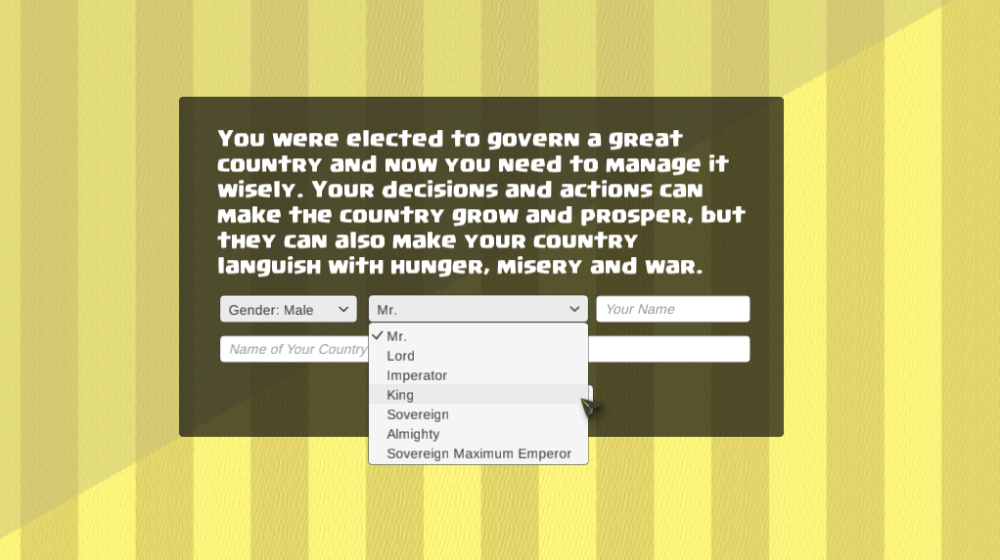
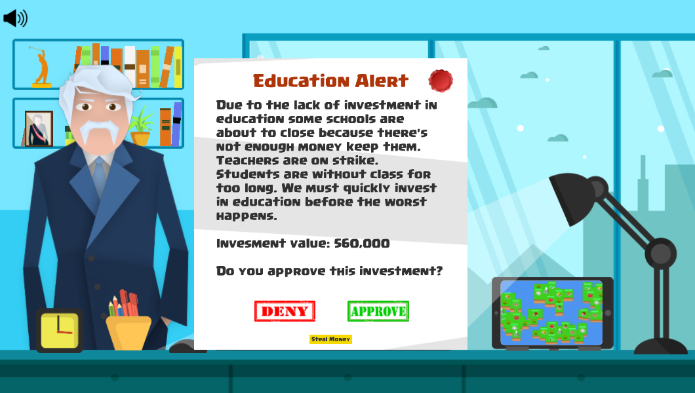
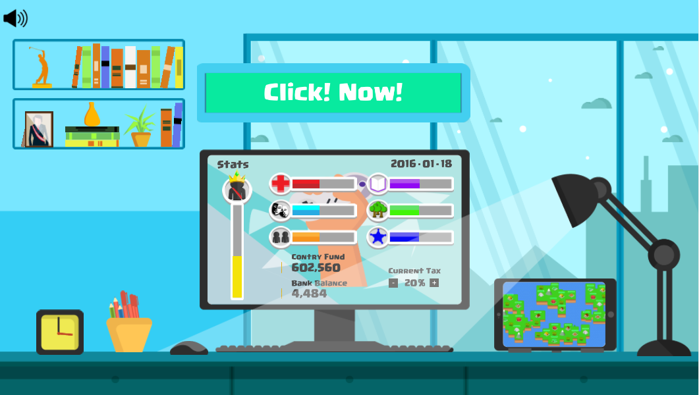
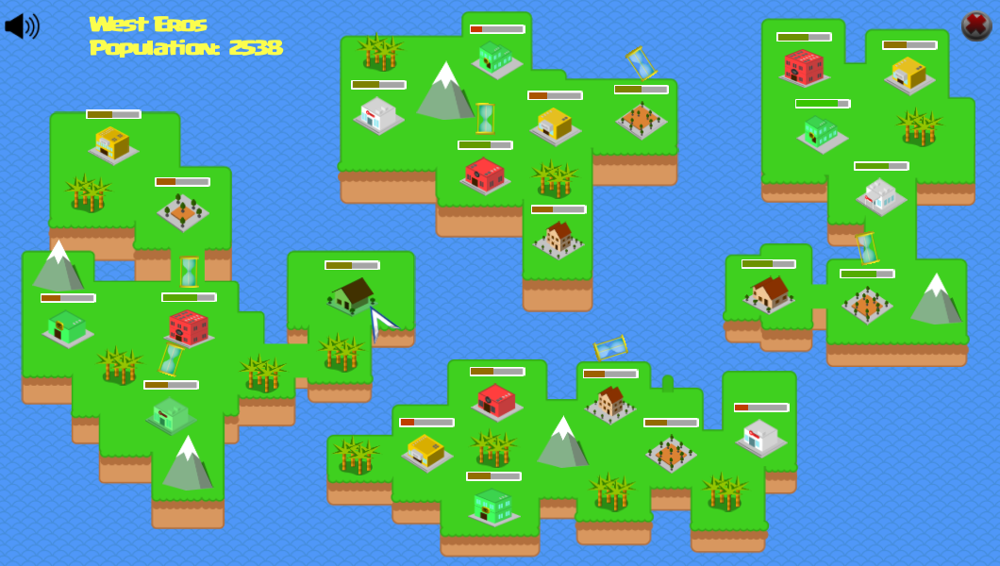
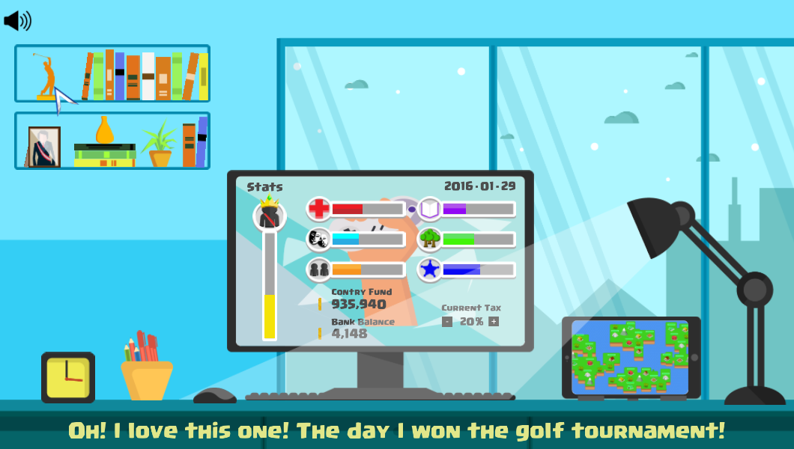
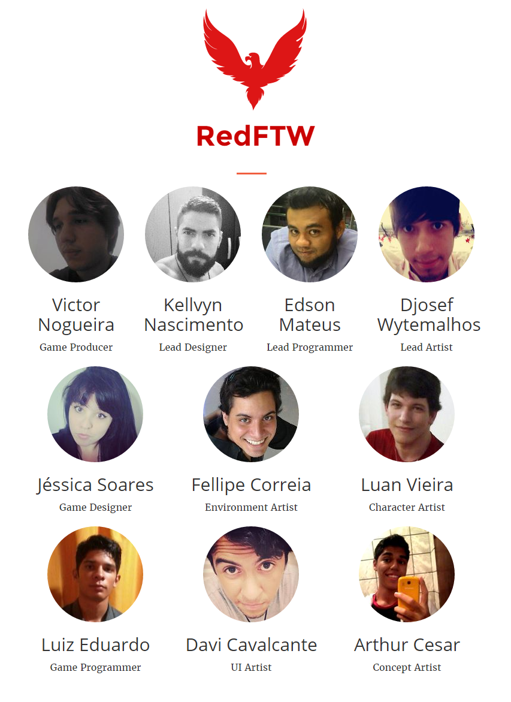

# Head of State

Head of State is an Unity3D game prototype based on presidential matters.

It's not a complete game, but our team decided to share it as a case study. So we'll be glad if anyone can learn from it.

The programming was made in MVC patters as described [here](https://github.com/felladrin/unity3d-mvc).

Enjoy!

## Development timelapse

*Click the image to watch the [development timelapse video](https://www.youtube.com/watch?v=pHccGxY50cU) on Youtube.*

## Screenshots

## Meet the team

